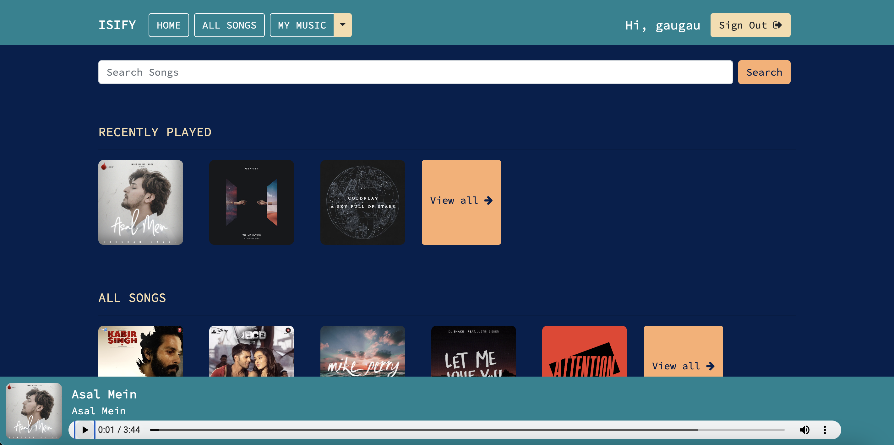
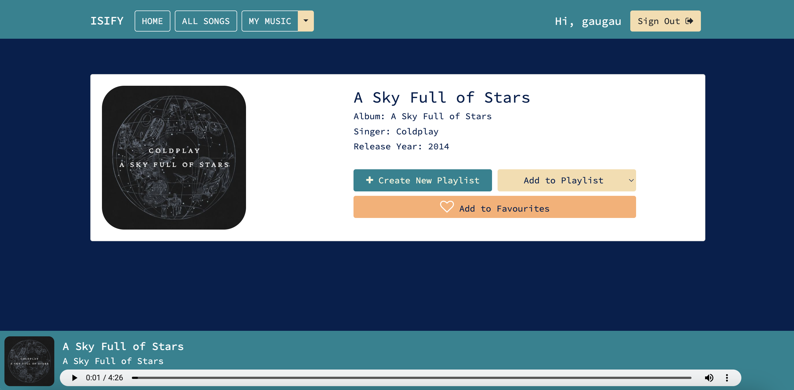

# Django based music streaming website

### Website Preview
#### Home Page


#### Detail Page


----

## Installation 📦

>pip install -r requirements.txt

#### Clone

- Clone this repo to your local machine.

#### Download New Dataset of Music

Link download:

https://drive.google.com/drive/u/2/folders/1qwsaKrBBrTkqa9aZPzOsm_FaX2j-UA8b

```shell
#Unzip downloaded data into media folder
unzip new_song.zip -o ./media

#Run script to import new_song to dataset
cd notebook
python import_new_songs.py
# or use notebook to debug
import_new_songs.ipynb
```

#### Run server locally

```shell
$ python manage.py runserver
```
> Go to localhost:8000

---

## Features 📋
⚡️ SignUp and SignIn option.\
⚡️ Google SignUp and SignIn option.\
⚡️ Play song, view detailed information of song.\
⚡️ Search songs.\
⚡️ Filter songs based on language and singer.\
⚡️ Create new playlist.\
⚡️ Add/Remove songs to/from playlist.\
⚡️ Add/Remove songs to/from favourites.\
⚡️ Scroll through recently played/viewed songs.\
⚡️ Explore songs through your personalized playlist and favourites.\
⚡️⚡️⚡️ Recommend new music based on KNN and KMeans algorithms


---

## Contributing 💡


#### Step 1

- **Option 1**
    - 🍴 Fork this repo!

- **Option 2**
    - 👯 Clone this repo to your local machine.


#### Step 2

- **Build your code** 🔨🔨🔨

#### Step 3

- 🔃 Create a new pull request.
